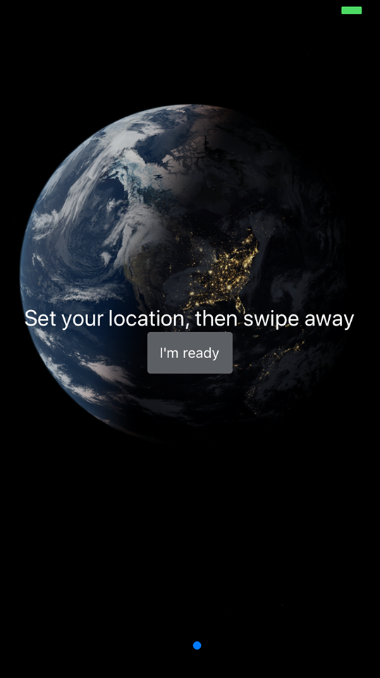
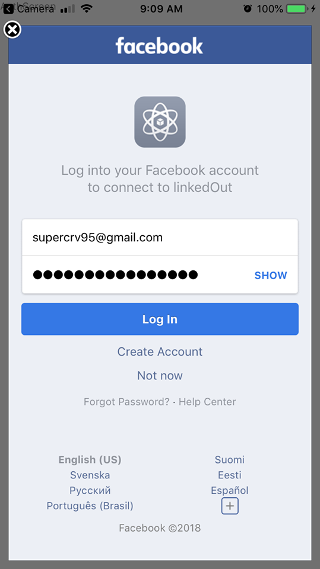

# linkedOut
Are you exhausted with your current job?
<br>
Do you want to escape from your workplace and seek for opportunities that you truly deserve?
<br>
If yes then LinkedOut is a perfect solution for you. Start discovering jobs around where you can do what you really love. 
```javascript
  npm install
```
## Features
- [x] Facebook authentication
- [x] Search for jobs around a certain location
- [x] Map view for specific jobs
- [x] Save favorite jobs by "Tinder-swipe-style"
- [x] Save and persist favorite jobs in local storage
- [x] Clear all preferences

## Tech stack
### Environment
* Expo
### Front-end
* React Native, Redux, Redux Persist
### Navigation
* React Navigation

## Demo
| Welcome     | Welcome 2   | 
| :-------------: | :-------------: | 
|  |  |

| Facebook authentication    | Login   | 
| :-------------: | :-------------: | 
|  |  |

| Map    | Like jobs by swiping   | List of liked jobs 
| :-------------: | :-------------: | :-------------: |
|  |  |

| Clear all preferences     | 
| :-------------: |
|  | 